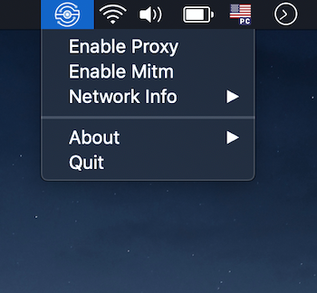

### <b>Mitmproxy Menubar</b>

Mitmproxy Menubar is an open source menu bar application for Mac OS to easily configure and start mitmproxy. You can configure local proxy and start/stop <b>mitmweb</b>.

This application is just intended to make this process of start/stop proxy faster.

To download the latest version visit the [releases page](https://github.com/erickjung/mitmproxy_menubar/releases)

### <b>How to use</b>

This application embedded a mitmweb version, so you just need to open the app.

Menu:

<ul>
  <li><b>Enable Proxy</b> - will configure all active macOS connections with localhost proxy (<b>localhost:8080</b>) for HTTP and HTTPS </li>
  <li><b>Enable Mitm</b> - will open the embedded version of mitmweb</li>
  <li><b>Network Info</b> - the information for active macOS connections, so you can use in your devices easily</li>
</ul>

### <b>License</b>
MIT
